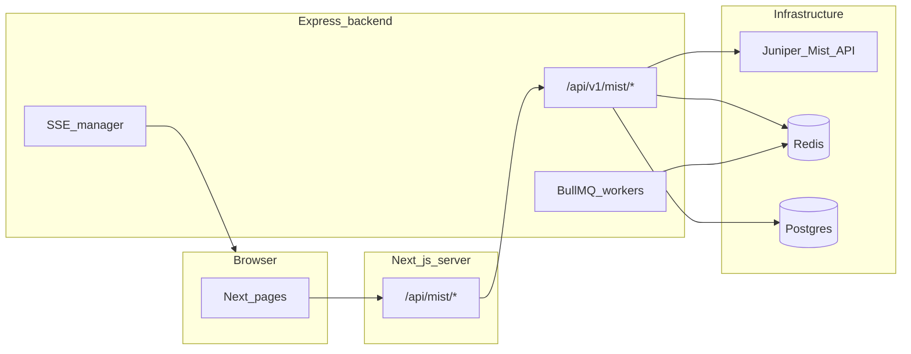
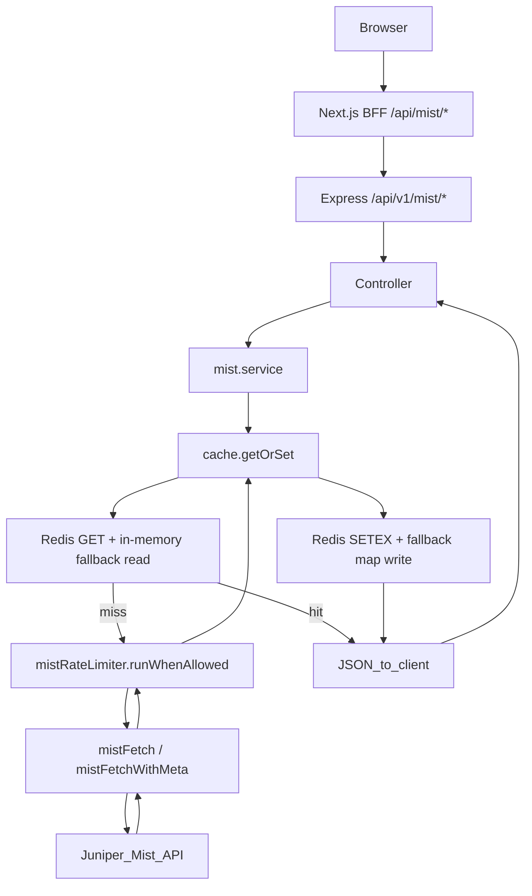
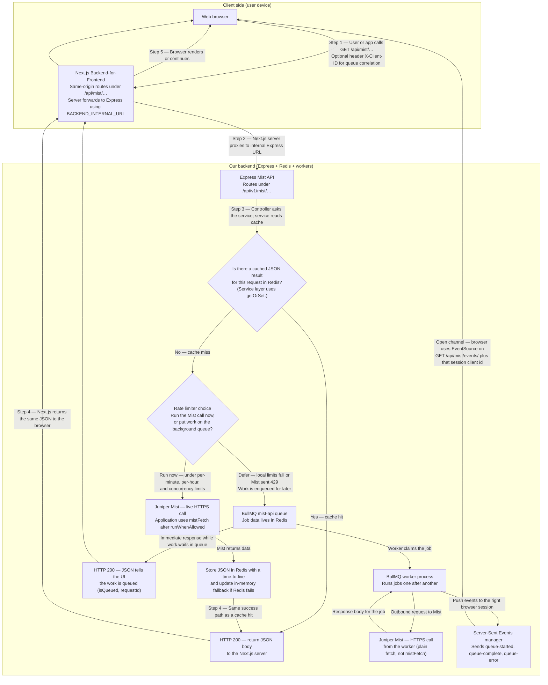

# Hamina Integrations

A comprehensive network management platform built with Next.js and Express.js, featuring Juniper Mist API integration with advanced rate limiting, caching, and real-time updates.

## Docker is required

Postgres, Redis, the Express API, and Next.js are orchestrated with **Docker Compose**. You need **Docker** and **Docker Compose** installed to run the app the way this repo expects (databases, queues, and internal networking). You can still run `npm install` on your host for editors and scripts, but **starting the full stack uses Compose**.

## How to start the app

### One-time setup

```bash
git clone <repository>
cd hamina-integrations
npm install
```

1. **Mist / BFF env (required)**  
   Copy `apps/frontend/.env.example` → **`apps/frontend/.env`** and set at least **`MIST_API_KEY`** and **`MIST_ORG_ID`** (see [Environment variables](#environment-variables) below).

2. **Compose substitution (optional)**  
   Copy **`.env.example`** → **`.env`** in the **repo root** if you want to override defaults for Compose (Postgres credentials, `DATABASE_URL`, Redis URL, etc.). Compose injects these when expanding `${VAR}` in `docker-compose.yml`.

### Run modes (dev vs production)

| Mode                                        | What                                                                 | Commands                                                                                                                                                                                                                                                                                    |
| ------------------------------------------- | -------------------------------------------------------------------- | ------------------------------------------------------------------------------------------------------------------------------------------------------------------------------------------------------------------------------------------------------------------------------------------- |
| **Dev (Docker, recommended)**               | Hot reload, full stack (Postgres, Redis, migrate, backend, frontend) | `docker compose --profile hamina up --build -d` → UI [http://localhost:3000](http://localhost:3000)                                                                                                                                                                                         |
| **Dev (host)**                              | Turbo / per-app `npm run dev`                                        | Requires DB, Redis, and backend reachable; see [Advanced: DB + Redis only on Docker](#advanced-db--redis-only-on-docker) and [Environment variables](#environment-variables).                                                                                                               |
| **Production build (Docker)**               | Compiled images (`hamina-build` profile)                             | `npm run docker:build` (same as `docker compose --profile hamina-build up --build -d`) → UI [http://localhost:3100](http://localhost:3100)                                                                                                                                                  |
| **Production build (local artifacts only)** | Compile without Compose                                              | Root `npm run build` (Turbo builds [`apps/frontend`](apps/frontend/package.json) and [`apps/backend`](apps/backend/package.json)); then `npm run start:frontend` / `npm run start:backend` with env. Postgres and Redis are still typically provided via Docker—see Compose profiles above. |

### Development stack (hot reload, published UI)

Runs **db**, **redis**, **prisma-migrate** (on profile `hamina`), **backend** (dev image), **frontend** (dev image).

```bash
npm run docker:build
```

| Service                | URL / access                                                                                                                                             |
| ---------------------- | -------------------------------------------------------------------------------------------------------------------------------------------------------- |
| **Next.js (UI + BFF)** | [http://localhost:3000](http://localhost:3000)                                                                                                           |
| **Postgres**           | `localhost:3762` (user/pass/db from `.env` or defaults in compose)                                                                                       |
| **Redis**              | **Not** published; backend uses **`REDIS_URL=redis://redis:6379`** on the Compose network (set in `docker-compose.yml` for `backend` / `backend-build`). |
| **Express**            | **Not** published on the host; Next BFF calls `http://backend:4000` inside the network (`BACKEND_INTERNAL_URL` on the frontend service).                 |

Stop: `docker compose --profile hamina down`

### Production-style build (compiled images)

Uses **`apps/backend/Dockerfile`** and **`apps/frontend/Dockerfile`**, plus db, redis, and migrate.

```bash
npm run docker:build
# equivalent:
docker compose --profile hamina-build up --build -d
```

| Service     | URL / access                                                                                                 |
| ----------- | ------------------------------------------------------------------------------------------------------------ |
| **Next.js** | [http://localhost:3100](http://localhost:3100)                                                               |
| **Express** | Internal only (`backend-build:4000`); `frontend-build` has `BACKEND_INTERNAL_URL=http://backend-build:4000`. |

### Useful npm scripts (from repo root)

| Script                                  | Purpose                                                                                                                                                                                                                                                                                 |
| --------------------------------------- | --------------------------------------------------------------------------------------------------------------------------------------------------------------------------------------------------------------------------------------------------------------------------------------- |
| `npm run docker:build`                  | Production-style stack (`hamina-build` profile), detached                                                                                                                                                                                                                               |
| `npm run docker:dev`                    | `docker compose --profile db --profile backend --profile frontend up --build` (includes **Redis** because the `redis` service also uses the `backend` profile). Does **not** run **`prisma-migrate`**; use **`hamina`** or `npm run docker:migrate` if the DB schema is not up to date. |
| `npm run docker:migrate`                | One-shot Prisma migrate container (`prisma-migrate` profile)                                                                                                                                                                                                                            |
| `npm run docker:test:e2e`               | Build and run Playwright E2E **inside Docker** against the **`hamina`** stack (`PLAYWRIGHT_BASE_URL=http://frontend:3000`). See [End-to-end tests](#end-to-end-tests-playwright).                                                                                                       |
| `npm run dev --workspace apps/frontend` | Next dev **on host** (you must supply DB/Redis/backend yourself)                                                                                                                                                                                                                        |
| `npm run dev --workspace apps/backend`  | Express dev **on host** (same)                                                                                                                                                                                                                                                          |

### Advanced: DB + Redis only on Docker

If you run Next/Express with `npm run dev` on the host, start dependencies only:

```bash
docker compose --profile db --profile redis up -d
```

Then point **`DATABASE_URL`** / **`DIRECT_DATABASE_URL`** at `localhost:3762`, **`REDIS_URL`** at `redis://127.0.0.1:6379` (if Redis runs on the host) **or** temporarily map Redis in compose (e.g. `ports: ["6381:6379"]`) and use that URL, and **`BACKEND_INTERNAL_URL`** / **`NEXT_PUBLIC_*`** at `http://127.0.0.1:4000` in `apps/frontend/.env`, and run migrations against that DB (`npm run db:migrate --workspace @repo/db` with env loaded).

## Architecture

### End-to-end request path

The browser loads Next.js App Router pages: [`/sites`](<apps/frontend/src/app/(main)/sites/page.tsx>), [`/site/[siteId]`](<apps/frontend/src/app/(main)/site/[siteId]/page.tsx>), and [`/site/[siteId]/devices/[deviceId]`](<apps/frontend/src/app/(main)/site/[siteId]/devices/[deviceId]/page.tsx>).

**BFF (Next.js server):** Route handlers under [`apps/frontend/src/app/api/mist/`](apps/frontend/src/app/api/mist/) proxy to Express using [`getBackendInternalBaseUrl()`](apps/frontend/src/lib/backend-internal-url.ts). In Docker, set **`BACKEND_INTERNAL_URL`** (e.g. `http://backend:4000`) so the BFF reaches the API on the Compose network.

**Express API:** [`apps/backend/src/routes/mist.routes.ts`](apps/backend/src/routes/mist.routes.ts) (and related controllers/services) exposes `/api/v1/mist/...`, calls **Juniper Mist**, and uses **Redis** (cache plus BullMQ), **Postgres** (Prisma via [`@repo/db`](packages/database)), and **SSE** for queue updates where applicable.

See also: [Docker services](#docker-services), [Environment variables](#environment-variables), and [API Endpoints](#api-endpoints) (BFF vs Express paths).



### Mist request lifecycle (cache, rate limit, BullMQ, SSE)

Traffic is **browser →** Next BFF ([`apps/frontend/src/app/api/mist/`](apps/frontend/src/app/api/mist/)) **→** Express ([`mist.routes.ts`](apps/backend/src/routes/mist.routes.ts)) **→** [`mist.service.ts`](apps/backend/src/services/mist.service.ts). **Cached JSON reads** use [`cache.getOrSet`](apps/backend/src/lib/cache/redis-cache.ts) (Redis + in-memory fallback). On a miss, loaders call [`mistFetch` / `mistFetchWithMeta`](apps/backend/src/lib/mist/client.ts), each gated by [`runWhenAllowed`](apps/backend/src/lib/mist/rate-limiter.ts) (per-minute, per-hour, concurrency). **Queue + SSE** ([`mist-queue.ts`](apps/backend/src/lib/mist/mist-queue.ts), [`sse-manager`](apps/backend/src/lib/sse/sse-manager.ts)) applies to browser flows that use [`executeRequest`](apps/backend/src/lib/mist/rate-limiter.ts) / `isQueued` — see the sequence diagram below. **Per-endpoint cache keys and TTLs** are in the [next subsection](#mist-data-endpoints-redis-keys-ttl-and-read-flow).

### Mist data endpoints: Redis keys, TTL, and read flow

All TTLs are **seconds** in Redis (`SETEX`). Full key = **`{keyPrefix}:{cacheKey}`** from [`CACHE_CONFIGS`](apps/backend/src/lib/cache/redis-cache.ts). If Redis errors or is down, [`RedisCache`](apps/backend/src/lib/cache/redis-cache.ts) falls back to an in-process map for **`CACHE_FALLBACK_TTL_MINUTES`** (default 10 min).

**Cached read flow** (typical `GET` that uses `getOrSet`):



**Endpoint reference** (Express path; BFF mirrors under `/api/mist/...` — see [API Endpoints](#api-endpoints)).

| BFF (browser)                              | Express `GET`                                  | Service function        | `getOrSet`                                                | Redis `keyPrefix`                                   | Cache key shape                      | TTL                          |
| ------------------------------------------ | ---------------------------------------------- | ----------------------- | --------------------------------------------------------- | --------------------------------------------------- | ------------------------------------ | ---------------------------- |
| `/api/mist/sites`                          | `/api/v1/mist/sites`                           | `getOrgSites`           | Direct                                                    | `mist:org:sites`                                    | `{orgId}:{page}:{limit}`             | **300 s** (5 min)            |
| `/api/mist/sites/[siteId]/site-summary`    | `/api/v1/mist/sites/:siteId/site-summary`      | `getSiteSummary`        | Via `buildMergedDevices`                                  | `mist:merged:devices:v2`                            | `{siteId}`                           | **300 s**                    |
| `/api/mist/sites/[siteId]/devices-catalog` | `/api/v1/mist/sites/:siteId/devices-catalog`   | `getSiteDevicesCatalog` | **None** (live Mist pagination)                           | —                                                   | —                                    | **Uncached**                 |
| `/api/mist/sites/[siteId]/devices`         | `/api/v1/mist/sites/:siteId/devices`           | `getDeviceList`         | Via `buildMergedDevices`                                  | `mist:merged:devices:v2`                            | `{siteId}`                           | **300 s** + in-memory filter |
| `/api/mist/sites/.../devices/[deviceId]`   | `/api/v1/mist/sites/:siteId/devices/:deviceId` | `getDeviceDetail`       | `buildMergedDevices` + Mist `GET …/devices/{id}` fallback | `mist:merged:devices:v2` (+ live Mist read on miss) | `{siteId}`                           | **300 s**                    |
| `/api/mist/inventory`                      | `/api/v1/mist/inventory`                       | `getOrgInventory`       | Direct                                                    | `mist:inventory:org`                                | `{orgId}:{JSON.stringify(filters)}`  | **900 s** (15 min)           |
| `/api/mist/sites/[siteId]/client-stats`    | `/api/v1/mist/sites/:siteId/client-stats`      | `getSiteClientStats`    | Direct                                                    | `mist:clients:site`                                 | `{siteId}:{JSON.stringify(options)}` | **120 s** (2 min)            |

**Merged devices loader** (cache miss for `mist:merged:devices:v2:{siteId}`): `GET /api/v1/sites/{id}/stats/devices` plus **paginated** `GET /api/v1/sites/{id}/devices` for **AP and switch**, merged in [`buildMergedDevices`](apps/backend/src/services/mist.service.ts). **Device detail** uses the merged list when possible, otherwise **Mist `GET /api/v1/sites/{id}/devices/{device_id}`** (e.g. switches). **Org sites loader**: `mistFetchWithMeta` to `GET /api/v1/orgs/{orgId}/sites` with `page`/`limit`.

**Not application-JSON cached** (no `getOrSet` on the response body):

| Express route                                         | Role                                                                                                                                                                                            |
| ----------------------------------------------------- | ----------------------------------------------------------------------------------------------------------------------------------------------------------------------------------------------- |
| `GET /api/v1/mist/events/:clientId`                   | Long-lived **SSE** stream ([`sseManager.addClient`](apps/backend/src/lib/sse/sse-manager.ts)).                                                                                                  |
| `GET /api/v1/mist/sites/:siteId/devices-stats/stream` | **SSE** proxy of Mist **WebSocket** `/api-ws/v1/stream` subscribed to `/sites/{siteId}/stats/devices` ([`mist-device-stats-stream.ts`](apps/backend/src/lib/mist/mist-device-stats-stream.ts)). |
| `GET /api/v1/mist/queue/status`                       | Live **BullMQ** + SSE stats (reads queue state in Redis, not a Mist payload cache).                                                                                                             |

**Throttling (all `mistFetch` / `mistFetchWithMeta` loaders)** — Before each Mist HTTPS request, [`runWhenAllowed`](apps/backend/src/lib/mist/rate-limiter.ts) waits until there is capacity under rolling **per-minute** (`MIST_MAX_REQUESTS_PER_MINUTE`, default **300**), **per-hour** (`MIST_MAX_REQUESTS_PER_HOUR`, default **5000**), and **10** concurrent calls. Retries after 429/5xx count as separate attempts. Env vars: [Environment variables](#environment-variables).

**BullMQ worker** jobs use raw `fetch` in [`mist-queue.ts`](apps/backend/src/lib/mist/mist-queue.ts) (not `mistFetch`); they do **not** consume `runWhenAllowed` slots.

**Reserved `CACHE_CONFIGS` (not used by `mist.service` today):** `mist:clients:summary`, `mist:device`, `mist:site:summary` — present in [`redis-cache.ts`](apps/backend/src/lib/cache/redis-cache.ts) for future use.

**Queue + SSE flow** — Read this top to bottom. **Rectangles** are systems or outcomes; **diamonds** are decisions. For most Mist **read** endpoints, a cache miss uses **`runWhenAllowed`** then **`mistFetch`** to Juniper Mist (not the browser queue path). The **background queue** branch applies when the API responds with **`isQueued`** and a **`requestId`**, and the browser already has an **EventSource** on **`/api/mist/events/{clientId}`**.



### Frontend (Next.js App Router)

- **Multi-site dashboard** at `/sites` with card-based layout and URL-driven pagination
- **Per-site views** at `/site/[siteId]` with device management and monitoring
- **Device detail pages** at `/site/[siteId]/devices/[deviceId]` with inventory and client information
- **Progressive loading** with queue service for rate-limited API calls
- **Real-time updates** via Server-Sent Events (SSE)

### Backend (Express.js)

- **3-layer architecture**: Routes → Controllers → Services
- **Rate limiting** with BullMQ queue system and exponential backoff
- **Redis caching** with in-memory fallback when Redis is unavailable
- **Enhanced device detection** using multiple Mist API endpoints
- **Bull Board dashboard** for queue monitoring with basic authentication

## Repository structure

- [`apps/frontend/`](apps/frontend/) — Next.js App Router, BFF routes, Mist UI ([`src/components/mist/`](apps/frontend/src/components/mist/), [`src/components/sites/`](apps/frontend/src/components/sites/)), queue client ([`src/lib/queue/`](apps/frontend/src/lib/queue/))
- [`apps/backend/`](apps/backend/) — Express entry [`server.ts`](apps/backend/server.ts), routes, Mist/cache/queue/SSE libraries
- [`packages/database/`](packages/database/) — Prisma, `@repo/db`
- [`packages/ts-shared/types/`](packages/ts-shared/types/) — `@repo/types`
- [`packages/ts-shared/ui/`](packages/ts-shared/ui/) — `@repo/ui`
- [`docker-compose.yml`](docker-compose.yml), [`scripts/`](scripts/), root [`package.json`](package.json) / [`turbo.json`](turbo.json)
- [`e2e/`](e2e/) — Playwright config and specs (see below)

## Features

### Mist API Integration

- **Organization sites** listing with pagination
- **Device inventory** with enhanced switch detection
- **Client statistics** for wireless access points — lists are built from Mist **`GET /api/v1/sites/{siteId}/stats/clients`** (BFF: `/api/mist/sites/.../client-stats`). On the device detail page, **Connected Clients** filters those rows to the current AP; the **Clients** summary card uses **`num_clients`** from AP device stats, so the two can differ if Mist omits AP linkage on client rows or results are paginated (we request up to 1000 rows per site when filtering by AP). Full flow, endpoints, and field mapping: [AP device detail: Connected Clients](#ap-device-detail-connected-clients).
- **Site summaries** with device counts and status
- **Real-time device monitoring** with connection status
- **How site table Status is determined** (merge, inventory enrichment, `resolveRowStatus`) — see [Site device status: Connected, Disconnected, and Unknown](#site-device-status-connected-disconnected-and-unknown)

### Performance & Reliability

- **Rate limiting**: Every **`mistFetch`** waits for capacity under rolling **per-minute** (default 300, `MIST_MAX_REQUESTS_PER_MINUTE`) and **per-hour** (default 5000, `MIST_MAX_REQUESTS_PER_HOUR`) caps plus **10** concurrent requests; aligns with typical Mist org quotas.
- **Caching strategy**: Redis — **5min** org sites (per page) and **5min** merged devices per site (summary/list/detail share one key); **15min** inventory; **2min** client stats; **10min** in-memory fallback when Redis is down
- **Queue system**: BullMQ with Redis backing for rate-limited requests
- **Progressive loading**: Site cards load basic info first, then enhance with inventory/client data
- **Error handling**: Graceful degradation with partial data display

### User Experience

- **Card-based site overview** with location, device counts, and client information
- **Enhanced device tables** with serial numbers, last seen, client counts, connection status
- **Device detail views** with inventory details and connected client lists (for APs)
- **URL-driven pagination** that persists on page reload
- **Real-time feedback** for queued requests via SSE

## Environment variables

Templates live in:

| File                             | Purpose                                                                                                                                      |
| -------------------------------- | -------------------------------------------------------------------------------------------------------------------------------------------- |
| **`apps/frontend/.env.example`** | BFF URL, Mist keys, optional `NEXT_PUBLIC_BACKEND_URL`. **Copy to `apps/frontend/.env`.**                                                    |
| **`.env.example` (repo root)**   | Postgres, Redis, queue/cache/Bull Board defaults for Compose substitution. **Copy to `.env` at repo root** if you override compose defaults. |

### Where values are loaded

| Mechanism                            | What it does                                                                                                                                                                                                                                                                                          |
| ------------------------------------ | ----------------------------------------------------------------------------------------------------------------------------------------------------------------------------------------------------------------------------------------------------------------------------------------------------- |
| **`env_file: ./apps/frontend/.env`** | In `docker-compose.yml`, both **`frontend`** and **`backend`** (and **`backend-build`**) load this file into the container process. **Put Mist secrets and shared app config here.**                                                                                                                  |
| **`environment:` in compose**        | Overrides per service, e.g. `NODE_ENV`, `PORT`, `DATABASE_URL` defaults, **`BACKEND_INTERNAL_URL=http://backend:4000`** (dev) or **`http://backend-build:4000`** (prod build), **`REDIS_URL=redis://redis:6379`** on **`backend`** / **`backend-build`** (internal Redis; not published to the host). |
| **Root `.env`**                      | Docker Compose reads **`.env`** next to `docker-compose.yml` for **`${VAR}`** interpolation (e.g. `${DATABASE_URL:-...}`, `${POSTGRES_USER:-postgres}` on the **`db`** service). Does **not** automatically inject into app containers unless the same name is passed via `environment` / `env_file`. |
| **`prisma-migrate` service**         | Gets `DATABASE_URL`, `DIRECT_DATABASE_URL`, `APP_SOURCE_NAME` from compose `environment` (can be fed from root `.env`).                                                                                                                                                                               |

### Variable reference (from code + compose)

| Variable                                              | Required               | Consumed by                                                   | Notes                                                                                                                                                        |
| ----------------------------------------------------- | ---------------------- | ------------------------------------------------------------- | ------------------------------------------------------------------------------------------------------------------------------------------------------------ |
| `MIST_API_KEY`                                        | **Yes** (runtime)      | Backend `getMistConfig()`                                     | Loaded from `apps/frontend/.env` in Docker.                                                                                                                  |
| `MIST_ORG_ID`                                         | **Yes**                | Backend                                                       | Same.                                                                                                                                                        |
| `MIST_API_BASE_URL`                                   | No                     | Backend                                                       | Default `https://api.mist.com`.                                                                                                                              |
| `MIST_WS_BASE_URL`                                    | No                     | Backend                                                       | Live-stats WebSocket host (default: REST `api.*` → `api-ws.*`, e.g. `wss://api-ws.mist.com`). See [`getMistWsBaseUrl`](apps/backend/src/lib/mist/config.ts). |
| `MIST_SITE_ID`                                        | No                     | Backend                                                       | Optional default site in dev.                                                                                                                                |
| `DATABASE_URL`                                        | Yes for DB/Prisma      | `@repo/db` / Prisma, compose defaults                         | In Docker, compose sets `postgresql://...@db:5432/...`.                                                                                                      |
| `DIRECT_DATABASE_URL`                                 | Yes for migrations     | Prisma / migrate service                                      | Often same as `DATABASE_URL`.                                                                                                                                |
| `POSTGRES_USER` / `POSTGRES_PASSWORD` / `POSTGRES_DB` | For Postgres container | **`db`** service `environment` in compose                     | Can be set via root `.env`.                                                                                                                                  |
| `REDIS_URL`                                           | No                     | Backend `redis-client.ts`                                     | Compose sets **`redis://redis:6379`** for **`backend`** / **`backend-build`** (internal). If unset locally, default is **`redis://127.0.0.1:6379`**.         |
| `REDIS_CLUSTER`                                       | No                     | Backend                                                       | Set `true` for cluster mode.                                                                                                                                 |
| `REDIS_PASSWORD`                                      | No                     | Documented in root `.env.example`                             | Wire into Redis URL if you secure Redis.                                                                                                                     |
| `CACHE_FALLBACK_TTL_MINUTES`                          | No                     | Backend `cache-config.ts`                                     | Default `10`.                                                                                                                                                |
| `REDIS_HEALTH_CHECK_INTERVAL_MS`                      | No                     | Backend                                                       | Default `30000`.                                                                                                                                             |
| `MIST_QUEUE_CONCURRENCY`                              | No                     | Backend BullMQ worker                                         | Default `5`.                                                                                                                                                 |
| `MIST_MAX_REQUESTS_PER_MINUTE`                        | No                     | Backend `mistFetch` throttle                                  | Default `300` (rolling 1 min).                                                                                                                               |
| `MIST_MAX_REQUESTS_PER_HOUR`                          | No                     | Backend `mistFetch` throttle                                  | Default `5000` (rolling 1 h; typical Mist org cap).                                                                                                          |
| `BASIC_AUTH_USER` / `BASIC_AUTH_PASS`                 | No                     | Bull Board route                                              | Defaults `admin` / `changeme`.                                                                                                                               |
| `PORT`                                                | No                     | Backend `server.ts`                                           | Compose sets `4000` for backend services.                                                                                                                    |
| `NODE_ENV`                                            | No                     | Compose + Node                                                | `development` / `production` per service.                                                                                                                    |
| `BACKEND_INTERNAL_URL`                                | **Yes for BFF**        | Next.js **server** API routes (`getBackendInternalBaseUrl()`) | Compose sets Docker service URL; local dev use `http://127.0.0.1:4000`.                                                                                      |
| `NEXT_PUBLIC_BACKEND_URL`                             | No                     | Fallback in `getBackendInternalBaseUrl()` only                | Do **not** set to `http://backend:4000` (browser cannot resolve). See `apps/frontend/.env.example`.                                                          |
| `APP_SOURCE_NAME`                                     | No                     | `prisma-migrate` service                                      | Default `unknown`.                                                                                                                                           |

## Development

### Prerequisites

- **Docker** and **Docker Compose** (required to run the stack)
- **Node.js 18+** and **npm** (for local install, types, lint)
- **Mist API** credentials in `apps/frontend/.env`

### Commands (host)

```bash
# Type checking
npm run check-types --workspace apps/frontend
npm run check-types --workspace apps/backend

# Linting
npm run lint --workspace apps/frontend
npm run lint --workspace apps/backend
```

### End-to-end tests (Playwright)

Prerequisites:

- Full stack running with valid Mist credentials (e.g. `docker compose --profile hamina up --build -d`).
- [`apps/frontend/.env`](apps/frontend/.env.example) configured with **`MIST_API_KEY`** and **`MIST_ORG_ID`** (see [Environment variables](#environment-variables)).

One-time browser install for Playwright:

```bash
npx playwright install
```

**`PLAYWRIGHT_BASE_URL`** — Base URL for tests (default `http://localhost:3000`). Use `http://localhost:3100` when exercising the production-style Docker UI (`hamina-build`).

**`PLAYWRIGHT_E2E_SITE_ID`** — Optional. Device detail E2E uses a fixed default site to load the [site devices](<apps/frontend/src/app/(main)/site/[siteId]/page.tsx>) table, then opens the first device from `GET /api/mist/sites/{siteId}/devices`. Set this env var to use another site UUID in your org.

Run tests **on the host** (requires `npx playwright install` as above):

```bash
npm run test:e2e
```

Run tests **in Docker** with a single command (no local Chromium install):

```bash
npm run docker:test:e2e
```

That runs `docker compose --profile hamina --profile e2e build e2e` and then `docker compose --profile hamina --profile e2e run --rm e2e`. In order:

1. **Image** — [`e2e/Dockerfile`](e2e/Dockerfile) extends the official Playwright image, copies the repo, and runs **`npm ci`** so `@playwright/test` matches the lockfile.
2. **Compose** — The **`e2e`** service ([`docker-compose.yml`](docker-compose.yml)) joins the default network, depends on **`prisma-migrate`** (`service_completed_successfully`) and **`frontend`** (`service_started`), and sets **`PLAYWRIGHT_BASE_URL=http://frontend:3000`** so tests call the dev UI by Docker DNS (not `localhost`).
3. **Entrypoint** — [`e2e/docker-entrypoint.sh`](e2e/docker-entrypoint.sh) polls **`PLAYWRIGHT_BASE_URL`** until the app returns HTTP 200, then runs **`npm run test:e2e`**.
4. **Artifacts** — `playwright-report/` and `test-results/` on the host are bind-mounted from the container so you can open the HTML report after the run.

Optional: set **`PLAYWRIGHT_E2E_SITE_ID`** in your shell or root **`.env`** (Compose interpolation) to override the default site UUID used by the device-detail spec.

Keep the Playwright **image tag** in [`e2e/Dockerfile`](e2e/Dockerfile) aligned with the resolved **`@playwright/test`** version in `package-lock.json` (under `node_modules/@playwright/test`).

Site overview and site-devices specs resolve the **first org site** from the API at runtime. The **device detail** spec targets a **known default site** (overridable via **`PLAYWRIGHT_E2E_SITE_ID`**), loads that site’s device table in the browser, then picks the **first device** from the same devices endpoint and asserts the detail **`h1`**. If Mist returns no data or the API errors, affected specs **skip** with an explanatory message. After a run, open the [HTML report](https://playwright.dev/docs/test-reporters#html-reporter) via `npx playwright show-report` (artifacts under `playwright-report/`).

### Docker build: `npm` ECONNRESET / network aborted

Image builds use **BuildKit** with an **npm cache mount**, longer **fetch timeouts**, more **per-request retries**, and **two full `npm install` retries** with backoff. If installs still fail:

1. **Retry** the same `docker compose build` (often transient registry/Wi‑Fi drops).
2. **Stable network** — try wired, VPN off, or another connection.
3. **Linux: build with host networking** (can help with Docker DNS/NAT):
   ```bash
   DOCKER_BUILDKIT=1 docker build --network=host -f apps/backend/Dockerfile .
   ```
4. **Corporate proxy** — set `HTTP_PROXY` / `HTTPS_PROXY` for the daemon or build, and npm `proxy` / `https-proxy` if required.

## API Endpoints

### Frontend (BFF Routes)

- `GET /api/mist/sites` - Organization sites with pagination
- `GET /api/mist/sites/[siteId]/site-summary` - Site device summary
- `GET /api/mist/sites/[siteId]/devices` - Site devices with filtering
- `GET /api/mist/sites/[siteId]/devices-catalog` - Paginated Mist `GET /sites/{id}/devices` (AP + switch) for site table rows
- `GET /api/mist/sites/[siteId]/devices-stats/stream` - SSE live device stats (Mist WebSocket, same-origin)
- `GET /api/mist/sites/[siteId]/devices/[deviceId]` - Device details
- `GET /api/mist/inventory` - Organization inventory with filtering
- `GET /api/mist/sites/[siteId]/client-stats` - Site client statistics

### Backend (Express Routes)

- `GET /api/v1/mist/sites` - Org sites (cached **5min** per org/page/limit)
- `GET /api/v1/mist/sites/:siteId/site-summary` - Site summary (uses **5min** merged-devices cache per site)
- `GET /api/v1/mist/sites/:siteId/devices` - Site devices (same **5min** merged-devices cache)
- `GET /api/v1/mist/sites/:siteId/devices-catalog` - Full site device list from Mist `GET /sites/{id}/devices` (paginated AP + switch, uncached)
- `GET /api/v1/mist/sites/:siteId/devices-stats/stream` - SSE stream of live device stats (Mist WebSocket backend)
- `GET /api/v1/mist/sites/:siteId/devices/:deviceId` - Device detail (same **5min** merged-devices cache)
- `GET /api/v1/mist/inventory` - Org inventory (cached 15min)
- `GET /api/v1/mist/sites/:siteId/client-stats` - Client stats (cached 2min)
- `GET /api/v1/mist/events/:clientId` - SSE endpoint for real-time updates
- `GET /api/v1/mist/queue/status` - Queue and SSE statistics

### Monitoring

- `GET /admin/queues` - Bull Board dashboard (basic auth required)
- `GET /health` - Backend health check

## Deployment

### Production Build (`hamina-build` profile)

Uses **`apps/backend/Dockerfile`** and **`apps/frontend/Dockerfile`**, plus Postgres, Redis, and a one-shot Prisma migrate.

```bash
npm run docker:build
# same as:
docker compose --profile hamina-build up --build -d

# Or only backend/frontend images (you must start db, redis, migrate separately):
docker compose --profile backend-build --profile frontend-build up --build -d
```

**Access:** Next.js **http://localhost:3100** (Mist API via BFF). Express is **not** published on the host; it runs as `backend-build` on the Compose network (`BACKEND_INTERNAL_URL` on `frontend-build`).

### Docker Services

- **hamina-redis**: Redis 8.4 Alpine with persistence (internal port 6379 only unless you add a `ports` mapping for debugging)
- **hamina-backend**: Express.js API server
- **hamina-frontend**: Next.js web application
- **hamina-shared-db**: PostgreSQL database

## Monitoring & Debugging

### Bull Board Dashboard

Access queue monitoring at `/admin/queues` with basic authentication:

- View active, waiting, completed, and failed jobs
- Monitor job processing times and retry attempts
- Debug rate limiting and queue performance

### Queue Statistics

Monitor queue health via `/api/v1/mist/queue/status`:

```json
{
  "ok": true,
  "data": {
    "queue": {
      "waiting": 0,
      "active": 2,
      "completed": 150,
      "failed": 1
    },
    "sse": {
      "connectedClients": 3,
      "clients": ["client-uuid-1", "client-uuid-2"]
    }
  }
}
```

### Cache Performance

Redis cache with intelligent fallback:

- **Primary**: Redis with configurable TTL per data type
- **Fallback**: In-memory cache (10min TTL) when Redis unavailable
- **Health checks**: Automatic Redis connectivity monitoring
- **Pattern invalidation**: Selective cache clearing by key patterns

## Technology Stack

### Frontend

- **Next.js 16** with App Router and React 19
- **TypeScript** for type safety
- **Tailwind CSS** with shadcn/ui components
- **Lucide React** for icons
- **Server-Sent Events** for real-time updates

### Backend

- **Express.js** with TypeScript
- **BullMQ** for job queuing with Redis
- **ioredis** for Redis connectivity
- **Bull Board** for queue monitoring
- **Prisma** for database ORM

### Infrastructure

- **Docker Compose** for service orchestration
- **Redis 8.4** for caching and job queues
- **PostgreSQL** for application data
- **Nginx** (optional) for production reverse proxy

## Site device status: Connected, Disconnected, and Unknown

This section describes how the **Status** column on `/site/[siteId]` is filled end to end: Mist REST → backend merge and enrichment → APIs the dashboard calls → table resolution. **Live stats (SSE/WebSocket) does not set Status**; it only updates other columns when enabled (see [Future improvements](#future-improvements)).

### Pipeline overview

| Step | Where                                                                                      | Input                                                                      | Output                                                                                                                                                                                                                                                                                       |
| ---- | ------------------------------------------------------------------------------------------ | -------------------------------------------------------------------------- | -------------------------------------------------------------------------------------------------------------------------------------------------------------------------------------------------------------------------------------------------------------------------------------------- |
| 1    | Mist API                                                                                   | `GET /api/v1/sites/{siteId}/stats/devices`                                 | AP-centric stats rows (often with link/connection fields).                                                                                                                                                                                                                                   |
| 2    | Mist API                                                                                   | Paginated `GET /api/v1/sites/{siteId}/devices` (`type=ap` + `type=switch`) | Full site catalog rows (AP + switch).                                                                                                                                                                                                                                                        |
| 3    | Backend [`buildMergedDevices`](apps/backend/src/services/mist.service.ts)                  | Stats + catalog                                                            | `MistDeviceDetail[]`: stats rows merged with matching catalog by device key; devices only on catalog appended. Each row: `normalizeDevice(stats, config?)` → `toDeviceStatus(merged raw)`.                                                                                                   |
| 4    | Backend [`enrichUnknownStatusFromOrgInventory`](apps/backend/src/services/mist.service.ts) | Merged list                                                                | If any row has `status === "unknown"`, load `GET /api/v1/orgs/{orgId}/inventory?site_id=…` via [`getOrgInventory`](apps/backend/src/services/mist.service.ts), match by **id** then **normalized MAC**, set `connected` / `disconnected` from inventory. On failure, returns list unchanged. |
| 5    | Express                                                                                    | `GET /api/v1/mist/sites/:siteId/devices`                                   | `getDeviceList` → merged + enriched list (cached under `mist:merged:devices:v2`).                                                                                                                                                                                                            |
| 6    | Express                                                                                    | `GET /api/v1/mist/sites/:siteId/devices-catalog`                           | Catalog summaries only (no enrichment); drives table rows and pagination.                                                                                                                                                                                                                    |
| 7    | Browser                                                                                    | Dashboard `fetch`                                                          | Parallel: `site-summary`, `devices-catalog`, `devices` (merged).                                                                                                                                                                                                                             |
| 8    | Frontend [`resolveRowStatus`](apps/frontend/src/components/mist/mist-devices-table.tsx)    | Per row: catalog + `mergedById` + optional inventory                       | Final `MistDeviceStatus` for the **Status** badge.                                                                                                                                                                                                                                           |

### Backend: merge logic (`buildMergedDevices`)

| Branch          | Behavior                                                                                                                                                                             |
| --------------- | ------------------------------------------------------------------------------------------------------------------------------------------------------------------------------------ |
| Stats non-empty | For each stats row, find same-key catalog row, `normalizeDevice(stats, config)`. Append `normalizeDevice(device)` for catalog-only rows (typical **switches** not present in stats). |
| Stats empty     | Every catalog row → `normalizeDevice(device)` only.                                                                                                                                  |

`normalizeDevice` builds `{ ...config, ...stats }` and sets `status: toDeviceStatus(merged)` (see next table).

### Backend: `toDeviceStatus` (Mist row → `connected` \| `disconnected` \| `unknown`)

Implemented in [`mist.service.ts`](apps/backend/src/services/mist.service.ts) (`toDeviceStatus`, `truthyConnection`). Examples of fields considered (not exhaustive):

| Kind         | Mist-style fields (booleans/strings normalized)                                                                                                                                                                              |
| ------------ | ---------------------------------------------------------------------------------------------------------------------------------------------------------------------------------------------------------------------------- |
| Booleans     | `connected`, `device_connected`, `deviceConnected`, `cloud_connected`, `lan_connected`, `l2tp_connected`, `wan_up`; `disabled === true` → disconnected.                                                                      |
| String blobs | `status`, `connection_status`, `conn_status`, `device_status`, `cloud_connection_state`, `wan_status`, `oper_state`, `operational_state` — substrings like `connected`, `up`, `online` vs `disconnected`, `down`, `offline`. |

If nothing matches → **`unknown`** (common for switches on raw site `/devices` when Mist omits link state).

### Backend: org inventory enrichment

Runs only when at least one merged device is still `unknown`. Calls Mist **`GET /api/v1/orgs/{orgId}/inventory`** with `site_id`, `limit=1000`, `page=1`. Matching: **device id** first, else **MAC** after `normalizeMacForMatch` (hex only, lowercased).

```ts
// apps/backend/src/services/mist.service.ts — enrichUnknownStatusFromOrgInventory (excerpt)
// Early exit if no unknowns; try/catch returns `devices` unchanged on inventory failure.
const { devices: inv } = await getOrgInventory({
  siteId,
  limit: 1000,
  page: 1,
});
const byId = new Map(inv.map((r) => [r.id, r]));
// ...byMac keyed by normalizeMacForMatch(r.mac)...
return devices.map((d) => {
  if (d.status !== "unknown") return d;
  const invRow =
    byId.get(d.id) ??
    (d.mac && normalizeMacForMatch(d.mac).length >= 6
      ? byMac.get(normalizeMacForMatch(d.mac))
      : undefined);
  if (!invRow) return d;
  return { ...d, status: invRow.connected ? "connected" : "disconnected" };
});
```

Used by **`getDeviceList`**, **`getDeviceDetail`** (list lookup), and **`getSiteSummary`** so summary cards and merged API stay aligned.

### Backend: site summary metric cards (`getSiteSummary`)

| Counter                 | Rule                                                                                                                                       |
| ----------------------- | ------------------------------------------------------------------------------------------------------------------------------------------ |
| `byType.*.connected`    | `device.status === "connected"`                                                                                                            |
| `byType.*.disconnected` | Everything else (`disconnected`, `unknown`, or post-enrichment offline) so switches without explicit “up” still count as offline on cards. |

### Frontend: dashboard data sources

| Request                                                     | Purpose                                       | Status relevance                                                               |
| ----------------------------------------------------------- | --------------------------------------------- | ------------------------------------------------------------------------------ |
| `GET /api/mist/sites/{siteId}/devices-catalog`              | Table row list (names, ids, catalog `status`) | `catalog.status` from same `toDeviceStatus` normalization on catalog payloads. |
| `GET /api/mist/sites/{siteId}/devices`                      | Full merged + **server-enriched** details     | `merged.status` preferred in the table when not `unknown`.                     |
| `GET /api/mist/sites/{siteId}/site-summary`                 | Metric cards                                  | Uses same enriched list as above.                                              |
| `GET /api/mist/inventory?siteId=…` (from table `useEffect`) | Extra row data                                | Supplies `inventory.connected` when merged/catalog are still `unknown`.        |

### Frontend: `resolveRowStatus` (Status badge)

First match wins:

| Priority | Source        | Condition                                                                                     |
| -------- | ------------- | --------------------------------------------------------------------------------------------- |
| 1        | Merged device | `merged.status` exists and is not `unknown`.                                                  |
| 2        | Catalog row   | `catalog.status` is not `unknown`.                                                            |
| 3        | Org inventory | Row matched by id/MAC in client fetch → `inventory.connected` → `connected` / `disconnected`. |
| 4        | —             | `unknown` (Unknown badge).                                                                    |

```tsx
// apps/frontend/src/components/mist/mist-devices-table.tsx
const resolveRowStatus = (
  catalog: MistDeviceSummary,
  merged: MistDeviceDetail | undefined,
  inventory: InventoryDevice | undefined,
): MistDeviceStatus => {
  if (merged?.status && merged.status !== "unknown") return merged.status;
  if (catalog.status !== "unknown") return catalog.status;
  if (inventory) return inventory.connected ? "connected" : "disconnected";
  return "unknown";
};
```

### AP vs switch in practice

| Device type | Typical path to Connected/Disconnected                                                                                                                       |
| ----------- | ------------------------------------------------------------------------------------------------------------------------------------------------------------ |
| **AP**      | Often present in `/stats/devices` → merge sets status from stats + `toDeviceStatus`.                                                                         |
| **Switch**  | Often **only** on site `/devices` → `toDeviceStatus` may return `unknown` until **backend enrichment** (inventory) or **frontend inventory** match fills it. |

---

## AP device detail: Connected Clients

Example URL shape: `/site/{siteId}/devices/{deviceId}` (e.g. `http://localhost:3000/site/f339c0ca-e5c1-4e23-aed6-faf193307202/devices/00000000-0000-0000-1000-d420b080efbf`). Page component: `apps/frontend/src/app/(main)/site/[siteId]/devices/[deviceId]/mist-site-device-page.tsx`; detail UI: [`device-detail-view.tsx`](apps/frontend/src/components/mist/device-detail-view.tsx).

### Requests the browser makes (device page)

| Order        | Browser → BFF                                                          | BFF → Express                                      | Backend → Mist                                                                   | Purpose                                                                                     |
| ------------ | ---------------------------------------------------------------------- | -------------------------------------------------- | -------------------------------------------------------------------------------- | ------------------------------------------------------------------------------------------- |
| 1            | `GET /api/mist/sites/{siteId}/devices/{deviceId}`                      | `GET /api/v1/mist/sites/:siteId/devices/:deviceId` | `buildMergedDevices` cache + optional `GET /api/v1/sites/{siteId}/devices/{id}`  | Load **`MistDeviceDetail`** (`device.raw`, type, name, stats fields such as `num_clients`). |
| 2 (AP only)  | `GET /api/mist/sites/{siteId}/client-stats?apId={device.id}&limit=100` | `GET /api/v1/mist/sites/:siteId/client-stats`      | **`GET /api/v1/sites/{siteId}/stats/clients`** with a raised `limit` (see below) | Build the **Connected Clients** list for this AP.                                           |
| 3 (optional) | `GET /api/mist/inventory?siteId={siteId}&limit=1000`                   | `GET /api/v1/mist/inventory`                       | `GET /api/v1/orgs/{orgId}/inventory?site_id=…`                                   | **Inventory Details** block (serial, online/offline, profile, etc.).                        |

Device detail uses a plain **`fetch`** for the device JSON; client-stats and inventory go through the **queue service** (`X-Client-ID` header) like other BFF routes.

### Backend: `getSiteClientStats` when `apId` is set

Implemented in [`getSiteClientStats`](apps/backend/src/services/mist.service.ts) (used by [`getSiteClientStatsController`](apps/backend/src/controllers/mist.controller.ts)).

| Setting                          | Value                                                                                                                                                                             |
| -------------------------------- | --------------------------------------------------------------------------------------------------------------------------------------------------------------------------------- |
| Mist endpoint                    | `GET /api/v1/sites/{siteId}/stats/clients` with query `limit` (and optional `duration`).                                                                                          |
| `limit` when filtering by AP     | `min(1000, max(300, (options.limit ?? 100) * 10))`. For UI `limit=100` → **1000** rows requested so clients tied to the AP are less likely to be cut off by pagination.           |
| Why not Mist `ap_id` query param | Comment in code: Mist’s `ap_id` query is **unreliable**; we fetch a wide site list and filter server-side.                                                                        |
| Filter                           | Keep rows where `ap_id` on our normalized row (see below) equals **`options.apId`** (case-insensitive, trimmed).                                                                  |
| Cap after filter                 | `slice(0, options.limit ?? 100)` → at most **100** clients returned to the UI for the Connected Clients list.                                                                     |
| Cache                            | Redis key prefix **`mist:clients:site`** (per `siteId` + JSON-stringified options); TTL **120 s** — see [Mist data endpoints](#mist-data-endpoints-redis-keys-ttl-and-read-flow). |

### Mapping Mist client rows → `ClientStats` → UI

[`mapMistClientStatsRows`](apps/backend/src/services/mist.service.ts) maps each Mist object to [`ClientStats`](packages/ts-shared/types/src/mist/index.ts). **AP linkage** for filtering uses [`apIdFromMistClientRow`](apps/backend/src/services/mist.service.ts): first non-empty among Mist fields **`ap_id`**, **`ap`**, **`device_id`**.

| UI / API field            | Mist source fields (typical)                      |
| ------------------------- | ------------------------------------------------- |
| `mac`                     | `mac`                                             |
| `hostname`                | `hostname`                                        |
| `ip`                      | `ip`                                              |
| `ssid`                    | `ssid`                                            |
| `rssi`                    | `rssi` (shown as “−57 dBm” style in UI)           |
| `band`                    | `band` (e.g. `5` for 5 GHz)                       |
| `last_seen`               | `last_seen` (Unix seconds → formatted date in UI) |
| `is_guest`                | `is_guest`                                        |
| `ap_id` (for filter only) | `ap_id` **or** `ap` **or** `device_id`            |

In [`DeviceDetailView`](apps/frontend/src/components/mist/device-detail-view.tsx) **Connected Clients** renders up to **10** rows (`slice(0, 10)`) with hostname (fallback MAC), IP, SSID, guest badge, RSSI, band, and last seen — matching rows like _mursu3 / 10.2.2.78 / SSID: … / −57 dBm / 5 / date_.

### “Clients” summary card vs Connected Clients list

| UI block                                       | Data source                                                                 | Meaning                                                         |
| ---------------------------------------------- | --------------------------------------------------------------------------- | --------------------------------------------------------------- |
| **Clients** (large number in the metric strip) | `device.raw.num_clients` from the **device** payload (merged AP **stats**). | Mist’s count on that AP stats object.                           |
| **Connected Clients**                          | Filtered **`/stats/clients`** rows for this **`device.id`**.                | Individual client rows; capped at 100 from API, first 10 shown. |

They can **differ**: Mist may report `num_clients` while client rows use another id field, pagination may omit rows, or stats and client list may be briefly inconsistent. The UI includes an **info** modal on the device page when `num_clients > 0` but the filtered list is empty — see [`DeviceDetailView`](apps/frontend/src/components/mist/device-detail-view.tsx).

### Switches and non-AP devices

**Connected Clients** (and the client-stats `useEffect`) run only when `device.type === 'ap'`. Switches do not load wireless client rows through this path.

---

## Future improvements

- **Mist live device stats (SSE + WebSocket)** — The site dashboard (`/site/[siteId]`) can enable **Stream live stats**, which opens same-origin SSE (`GET /api/mist/sites/.../devices-stats/stream` → Express → Mist WebSocket `wss://…/api-ws/v1/stream`, subscribe `/sites/{siteId}/stats/devices`). Implementation: hub [`mist-device-stats-stream.ts`](apps/backend/src/lib/mist/mist-device-stats-stream.ts), BFF proxy `apps/frontend/src/app/api/mist/sites/[siteId]/devices-stats/stream/route.ts`, hook [`use-mist-device-stats-stream.ts`](apps/frontend/src/hooks/use-mist-device-stats-stream.ts), table merge in [`mist-devices-table.tsx`](apps/frontend/src/components/mist/mist-devices-table.tsx). **Good E2E checklist:** (1) open a site with APs, toggle live stats, confirm badge goes to “Live stats on” and AP rows update **Last seen / IP / Clients / Connection** when Mist pushes data; (2) stop live stats and confirm SSE closes and backend hub tears down the WS when the last subscriber leaves; (3) try a **regional** org — set `MIST_WS_BASE_URL` if REST is not `api.mist.com` (see [`getMistWsBaseUrl`](apps/backend/src/lib/mist/config.ts)). **Reliability work (connection sometimes fails):** add retries/backoff around initial WS connect, surface hub `stream_status` (`reconnecting` / `error`) in the UI with last error text, consider heartbeat/timeouts vs Mist’s behavior, and optionally add Playwright coverage that mocks upstream or asserts the stream toggle + degraded UI when the backend returns non-200 for the SSE route.

- **Site device table — Status** — Fully documented in [Site device status: Connected, Disconnected, and Unknown](#site-device-status-connected-disconnected-and-unknown) (merge, enrichment, `resolveRowStatus`, summary cards).

- **Load and rate-limit stress tests** — Add tooling (for example k6, Artillery, or distributed Playwright workers) to simulate **many concurrent users** hitting BFF and Express Mist routes, then observe **Redis cache hit rates**, **BullMQ depth**, **429 / queue enqueue behavior**, and **SSE fan-out** under the configured limits (see [`MistRateLimiter`](apps/backend/src/lib/mist/rate-limiter.ts)). Run against a non-production Mist org or mocked upstream so org API quotas stay safe.

- **3D site visualization (APs + switches)** — Render a navigable **3D / 2.5D** scene per site using indoor coordinates from Mist (`x_m`, `y_m`, `height`, `map_id`) plus merged device types and status; link into the existing table and device detail flows. Full library comparison, architecture, and phased plan: [3D site visualization](#3d-site-visualization-aps-switches-floor-context).

### 3D site visualization (APs, switches, floor context)

**Goal:** Add an interactive **3D (or 2.5D) view** of a Mist **site** that shows **access points** and **switches** in spatial context, with **connection/status** cues, deep links to the existing device table and detail pages, and optional alignment to **floor maps** when Mist provides coordinates.

**What we already have (integration points):**

| Source | Use in 3D |
|--------|-----------|
| Merged site devices (`GET /api/mist/sites/{siteId}/devices`, [`buildMergedDevices`](apps/backend/src/services/mist.service.ts)) | Device list, type (`ap` / `switch`), `id`, name, `status`. |
| Device raw fields `x_m`, `y_m`, `height`, `map_id` | Indoor placement in meters (same as [`device-floor-placement.tsx`](apps/frontend/src/components/mist/device-floor-placement.tsx)); devices without coordinates need a **fallback layout** (grid, circle pack, or stacked by floor). |
| Site org metadata (`latlng` on sites) | Optional **geo backdrop** or orientation only; indoor `x_m`/`y_m` remain primary for campus maps. |
| Live stats SSE (beta) | Future: tint meshes or halos by **live** reachability / client load (see live stream hub). |

**Recommended stack (frontend):**

| Option | Role | Pros | Cons |
|--------|------|------|------|
| **React Three Fiber (R3F)** + **three** + **@react-three/drei** | Default choice | Declarative React tree for scenes; `OrbitControls`, `PerspectiveCamera`, `Html` labels, `Instances` for many APs; huge ecosystem; fits Next.js App Router with dynamic `ssr: false` for the canvas. | WebGL only; bundle size; need resize + loading boundaries. |
| **Three.js** (imperative, no R3F) | Alternative | Full control, no extra abstraction. | More boilerplate; harder to keep in sync with React state. |
| **Babylon.js** (+ `@babylonjs/react` if used) | Alternative | Strong tooling, exporters, XR later. | Heavier runtime; less common in this repo’s stack today. |
| **deck.gl** | Geo-centric sites only | Excellent **lat/lng** layers, large point clouds. | Weak fit for **indoor meter** (`x_m`/`y_m`) unless you build a custom coordinate system; better as a **second view** for outdoor-only assets. |

**Suggested architecture:**

1. **New UI surface** — e.g. route ` /site/[siteId]/floor-3d` or a **tab / split pane** on the existing site dashboard; load the same merged device payload (and optionally inventory) the table already uses.
2. **Scene graph** — One `Scene` per site view: **lights**, **floor plane** (grid or textured quad), **device group** with separate materials for AP vs switch (instanced meshes when device count is large).
3. **Coordinates** — Use `(x_m, y_m)` as horizontal plane; use `height` (or a default) for vertical offset. Group by `map_id` / floor if Mist returns multiple maps (multi-floor: separate layers or Z offset per floor index).
4. **Interaction** — Raycast on click → highlight device → `router.push` to `/site/.../devices/{id}` or sync selection with URL `?highlight=`. **Keyboard**: orbit / pan alternatives; **reduced motion**: offer 2D schematic fallback (extend current floor placement card).
5. **Textures / floor truth** — Phase 2+: investigate Mist **map / floor plan** APIs or exported images; apply as a **plane texture** under devices; calibrate scale so `x_m`/`y_m` align (may need map metadata from Mist docs).
6. **Status encoding** — Color or emissive intensity from merged `status` (and later live stream); legend in UI matching **Connected / Disconnected / Unknown**.
7. **Performance** — `InstancedMesh` or drei `Instances` for 50–500 devices; `useFrame` only where needed; **dynamic import** of the canvas component to avoid SSR WebGL issues; observe **memory** on long sessions.
8. **Testing** — Visual regression (Playwright screenshots) optional; unit-test **coordinate normalization** and **fallback layout** pure functions in `@repo/ui` or `apps/frontend/src/lib/mist/`.

**Phased delivery:**

| Phase | Scope |
|-------|--------|
| **MVP** | R3F scene: grid floor, spheres/boxes for AP (e.g. cone) vs switch (box), labels from `Html`, navigation to device detail; devices without `x_m`/`y_m` in a side panel list or auto-ring layout. |
| **V2** | Floor image + calibration; multi-floor selector; table ↔ 3D selection sync. |
| **V3** | Live SSE coloring; client density heat (if per-AP counts available without overloading Mist). |

**Risks:** Mist coordinate coverage is **sparse** on some sites; map APIs and licensing; WebGL blocked on some corporate browsers — keep a **non-WebGL fallback** (current 2D schematic or table-only).

## License

MIT License - see LICENSE file for details.
